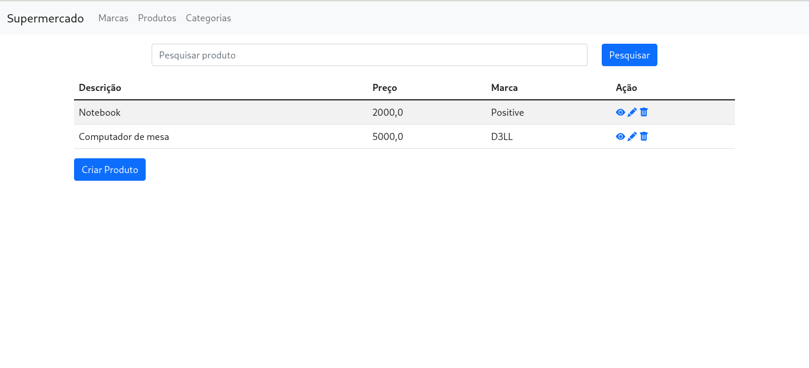
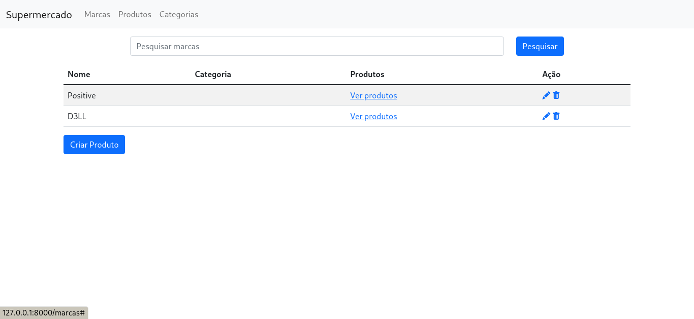
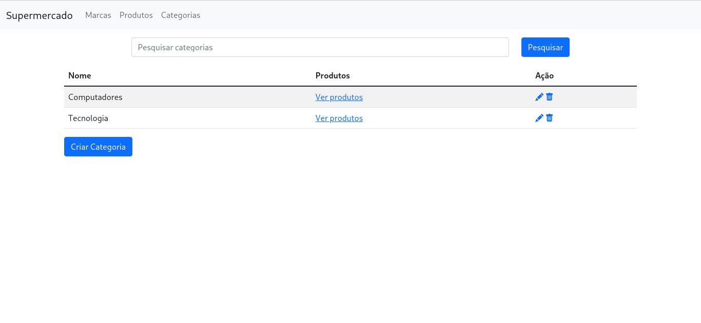
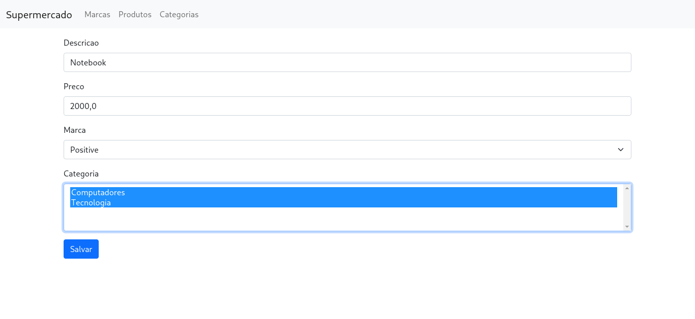
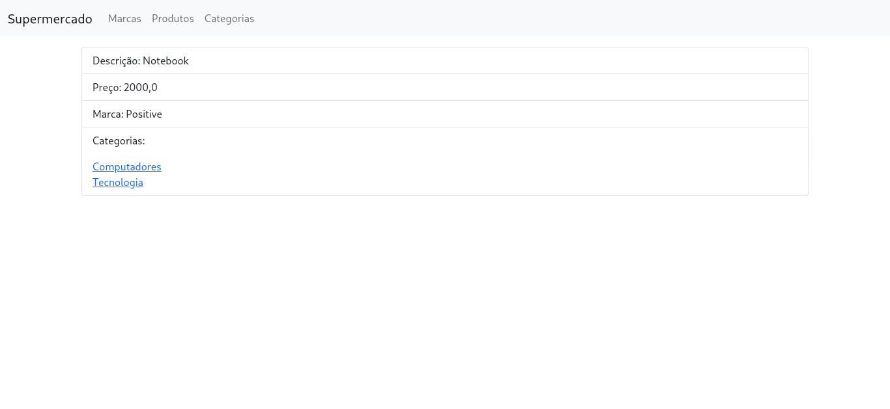

# CRUD Supermercado

Feito durante estudos de banco de dados em Django, o projeto consiste em um sistema onde é possível adicionar produtos com suas marcas e respectivas categorias.

## Contexto

Este projeto foi feito durante meus estudos de relacionamento utilizando o ORM do django.

## Telas

Lista de Produtos

Lista de Marcas

Lista de Categorias

Adicionar novo Produto

Exibir produto

## Tecnologias usadas:

- Mariadb

- Django

- Bootstrap 5
